## 平台介绍

沐霖工时系统(原无鱼工时系统），是一款轻量级工时记录和管理工具，包括项目管理，工时上报，工时日报，工时统计等功能。

沐霖工时系统可通过员工工时上报的方式，来记录项目所花费的工时，帮助企业进行项目工时统计、核算人工成本。实时、动态、真实的展示项目投入。

## 软件架构

Go 1.21+ + MySQL 8.0 + Redis 7.0 + Vue 3.5

本项目采用前后端分离架构，支持多种部署方式：

**后端技术栈：**
- 🚀 **Gin 1.10** - 高性能 HTTP Web 框架
- 💾 **GORM 1.25** - Go 语言 ORM 库
- 🔐 **JWT** - 身份认证机制
- 📦 **Viper** - 配置文件管理
- 📝 **Zap** - 结构化日志记录

**前端技术栈：**
- 🎨 **Vue 3.5** - 渐进式 JavaScript 框架
- ⚡ **Vite 6.3** - 新一代前端构建工具
- 🎯 **Element Plus** - Vue 3 组件库
- 📊 **ECharts 5.6** - 数据可视化图表库
- 🛣️ **Vue Router 4** - 官方路由管理器

**数据库：**
- 🗄️ **MySQL 8.0** - 关系型数据库
- 💨 **Redis 7.0** - 缓存数据库

**部署方式：**
- 🌐 **独立部署** - 前后端分离部署（Nginx + Go 二进制）
- 🐳 **Docker Compose** - 容器化一键部署
- 📦 **单程序嵌入式部署** - Go 二进制内嵌前端资源

## 版本说明

当前版本 V4.0.0

- **V4**
  - [x] v4.0.0 重大版本更新，前端全面升级至 Vue 3.5 + Vite 6.3，Go 后端重构，支持多种部署方式，工时类型分区块展示，双审核接口支持，多项问题修复和性能优化。

- **V3**
  - [x] v3.9.1 修复版本，主要修复任务列表、任务填报以及工时填报的显示优化和编辑报错。
  - [x] v3.9.0 增加任务、任务工时和任务日报。
  - [x] v3.8.3 修复版本，主要修复项目状态控制和工时统计的问题。
  - [x] v3.8.2 修复版本，主要修复搜索条件以及一些模块的翻页问题。
  - [x] v3.8.1 修复版本，主要修复在某些环境下无法启动的问题
  - [x] v3.8.0 增加项目工时统计模块
  - [x] v3.7.0 增加人员工时统计模块
  - [x] v3.6.1 优化部门列表，，修复项目更换项目经理的选择列表问题。
  - [x] v3.6.0 支持批量导入工时。
  - [x] v3.5.0 重构工时审核功能，支持按项目进行审核。
  - [x] v3.4.0 重构填报工时内容，增加任务完成度属性。
  - [x] v3.3.1 前端兼容性与调试优化。
  - [x] v3.3.0 基于 SpringBoot3 + vue3.2+ 进行重构。
  - [x] v3.2.1 优化审核列表，修复审核权限校验。
  - [x] v3.2.0 重构前端布局，优化首页样式和项目列表样式。
  - [x] v3.1.0 新增"按周"维度的项目统计功能，优化项目添加人员流程。
  - [x] v3.0.0 原「无鱼工时系统」更名为「沐霖工时系统」！

## 版本计划

    * [x] 支持按项目进行审核。
    * [x] 增加导入工时。
    * [x] 支持个人工时统计。(项目统计在项目看板中)
    * [x] 支持项目工时报表查看。
    * [x] 前端全面升级至 Vue 3.5 + Vite 6.3
    * [x] Go 后端重构
    * [x] 支持多种部署方式
    * [ ] 支持按部门统计。
    * [ ] 定时任务。
    * [ ] 任务甘特图。
    * [ ] 移动端优化。
    * [ ] 高级报表功能。
    * [ ] 实时通知。

## 功能列表

**工时模块**

1、我的工时：

普通工时填报

任务工时填报

工时类型分区块展示

**项目模块**

1、项目管理：项目列表、项目概要、项目工时记录、项目成员管理、项目状态管理。

**任务模块**

1、 项目任务列表：项目任务列表、任务详情、任务进度、任务工时、任务状态管理。

2、 任务日报：项目任务日报列表、任务日报详情。

**审核模块**

1、项目工时审核：项目工时审核列表、工时审核、审核详情。

2、双审核接口支持：项目工时和普通工时并行审核。

**数据统计**

1、数据概览统计：人员、项目、总工时、项目工时、普通工时、部门工时统计、明细查询。

2、人员统计：人员工时统计列表。

3、项目统计：项目工时统计列表。

4、填报记录查询：填报记录列表、填报记录详情。

**管理模块**

1、项目管理：创建项目、添加人员、状态管理、删除项目。

2、组织管理：用户管理、角色管理、重置密码、批量删除。

3、职位管理：包括筛选、新增、修改、删除、批量删除等功能。

**部署方式**

1、独立部署：传统前后端分离部署方式。

2、Docker Compose 一键部署：简化部署流程。

3、单程序嵌入式部署：Go 二进制 + 嵌入式前端资源。

## 功能截图

#### 首页

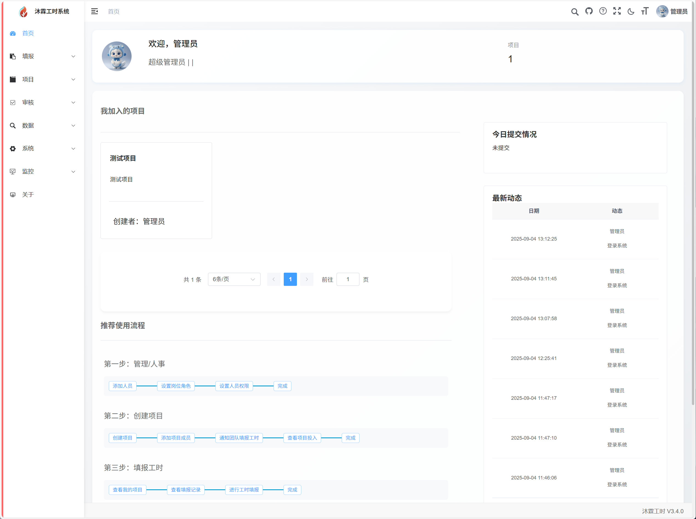

#### 普通工时填报

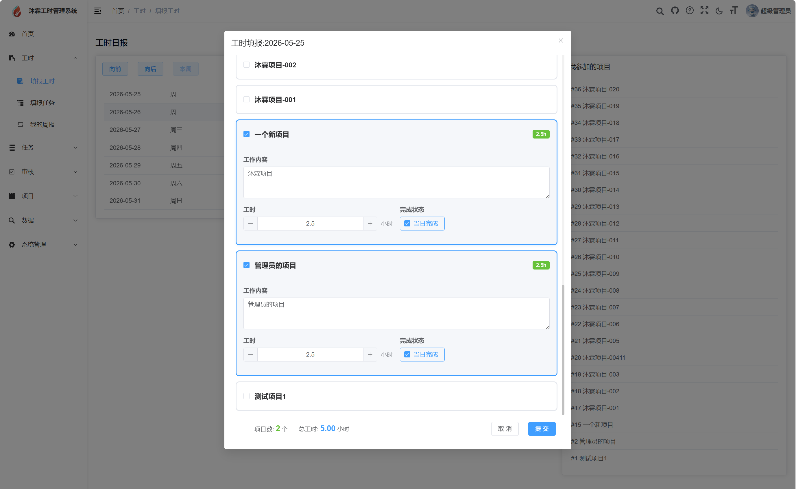

#### 工时填报流程

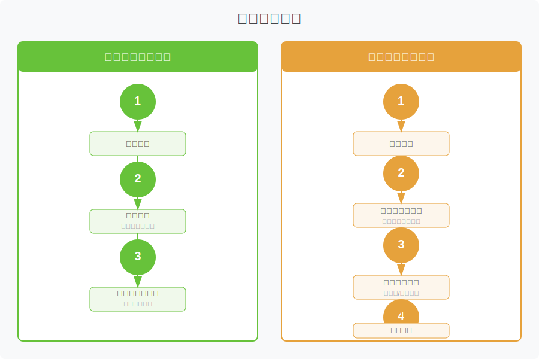

#### 批量导入

<table>
   <tr>
       <td>
     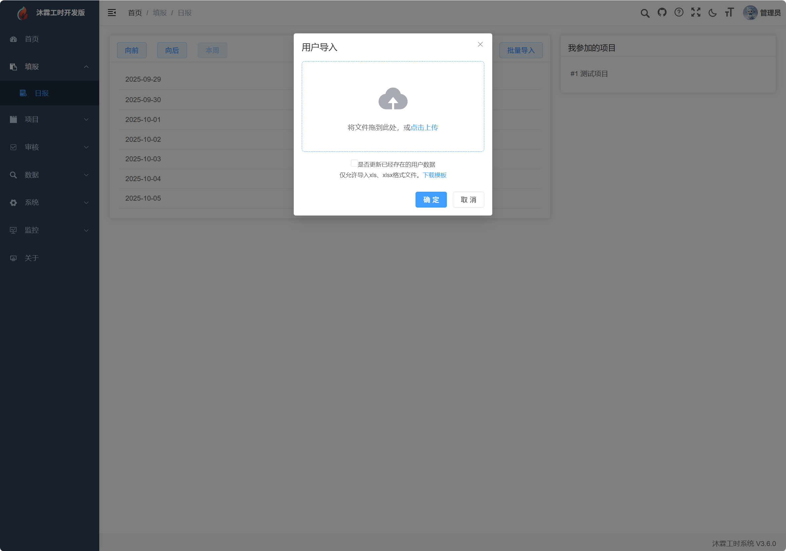   </td>
       <td>
     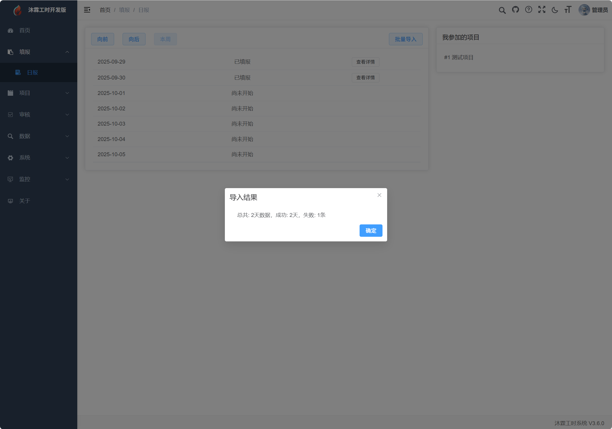
  </td>
   </tr>
</table>

#### 任务工时填报

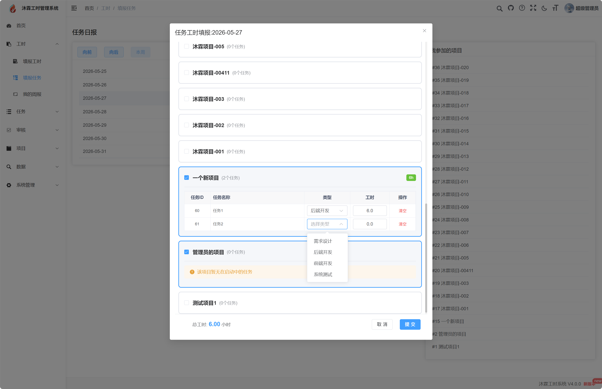

#### 任务工时填报流程

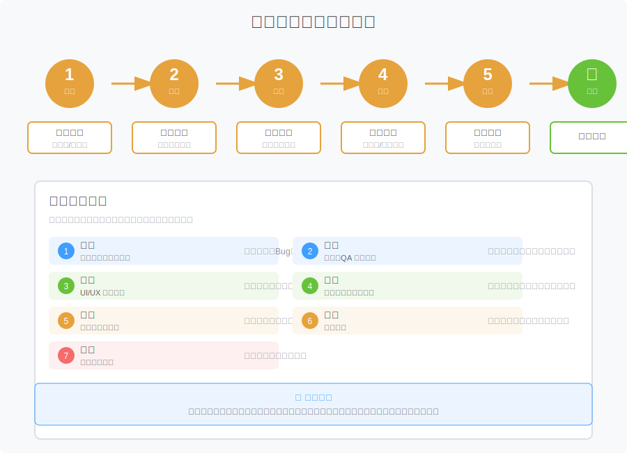

#### 工时审核

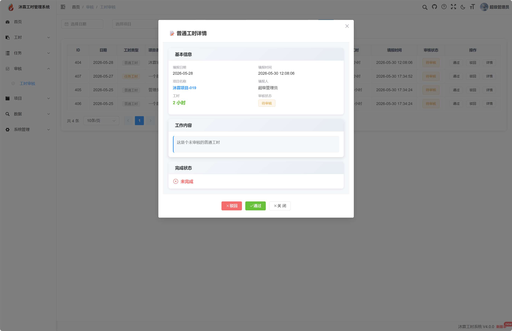

#### 工时审核流程

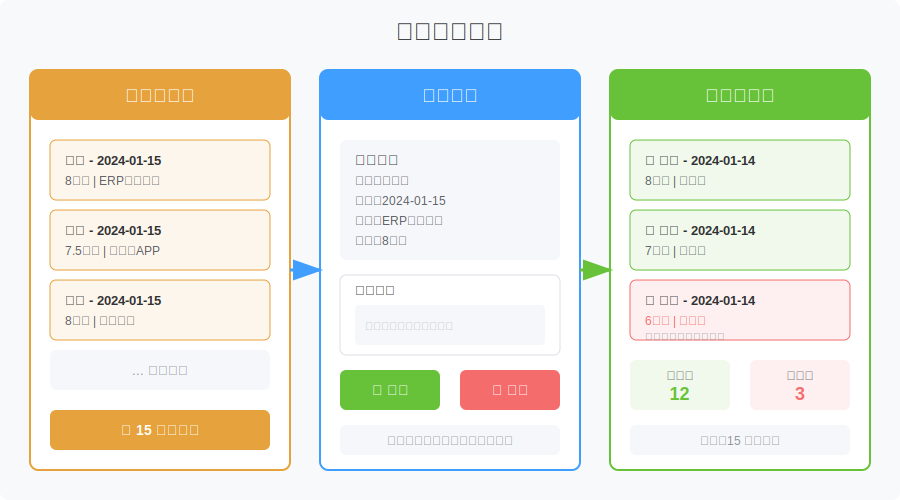

#### 任务管理

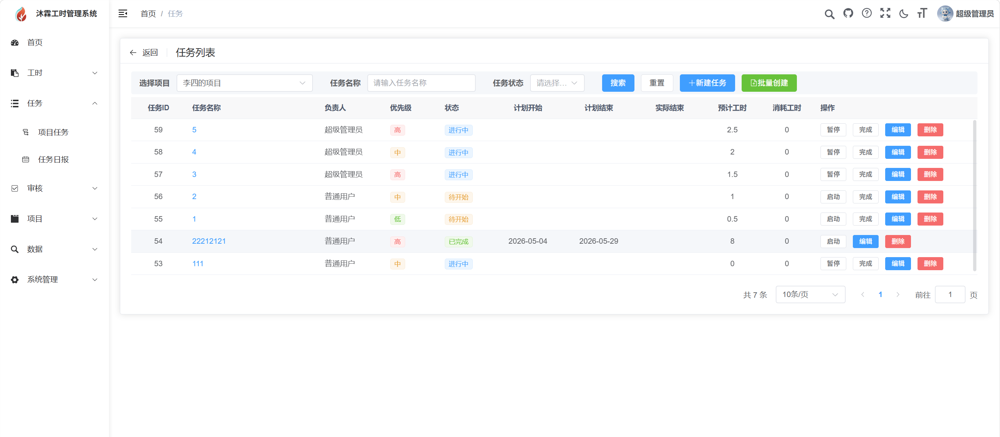

#### 任务日报

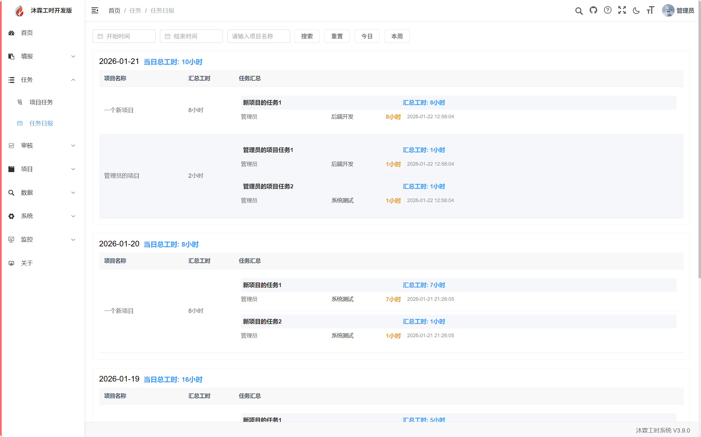

#### 数据看板

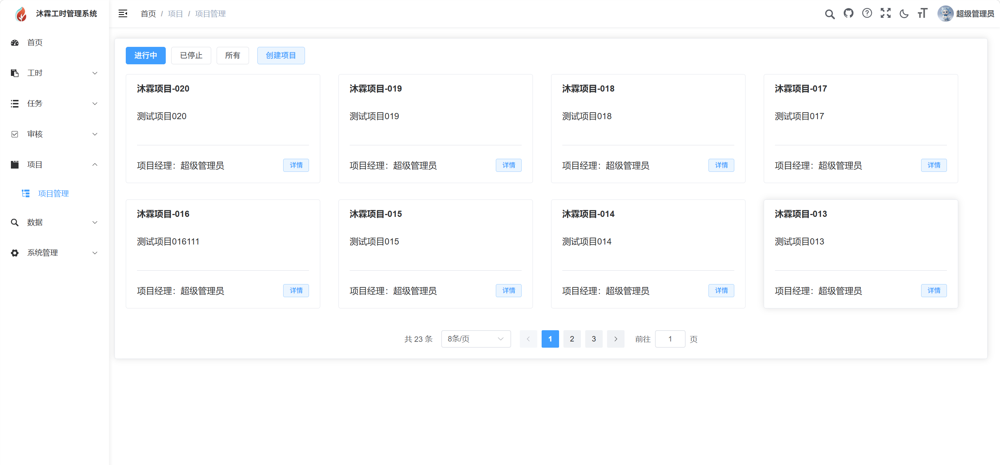

#### 数据统计

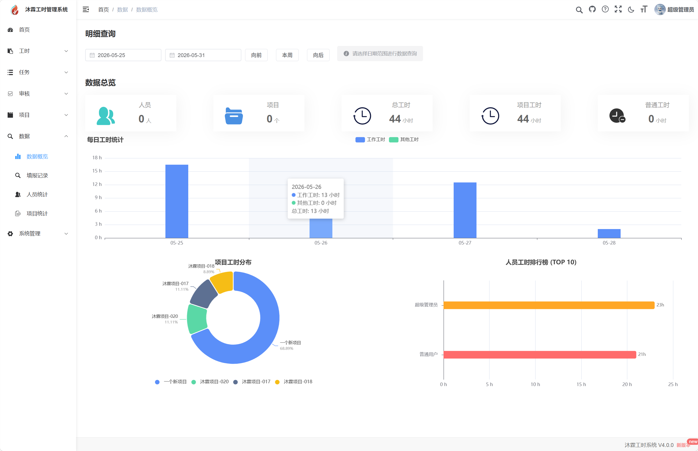

#### 数据统计概览

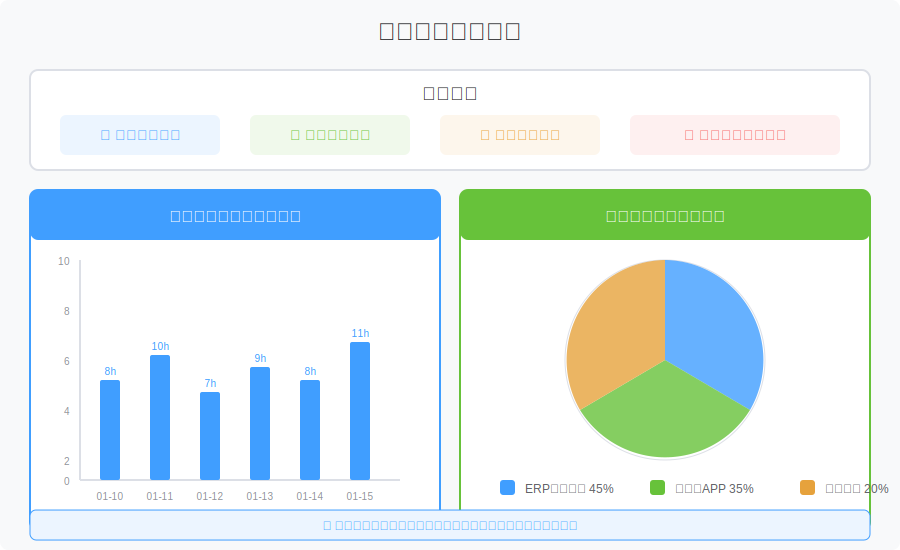

#### 周报查看

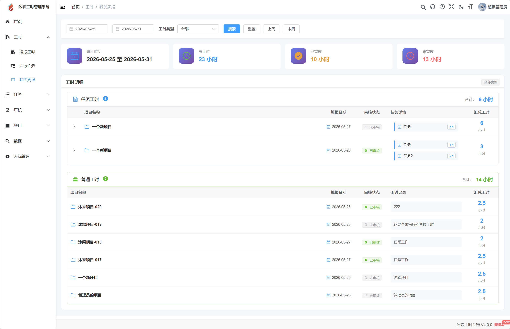

#### 周报卡片展示

## 测试环境

http://150.158.90.116:10809/

账号
请联系微信： moyu-boby 获取

## 下载使用

如使用 clone 方式存在部分文件丢失的情况，请到网盘或者 release 进行下载。

## 使用文档

站内 faq
https://doc.wuyusoft.com/
###

web 端默认地址:
http://ip:80

默认管理账号/密码：
admin/12345678

[//]: # "微信： Maprapta （添加请备注说明）"

## 感谢

该项目基于若依、vue、ele-admin-ui 等相关框架，在此进行感谢。
