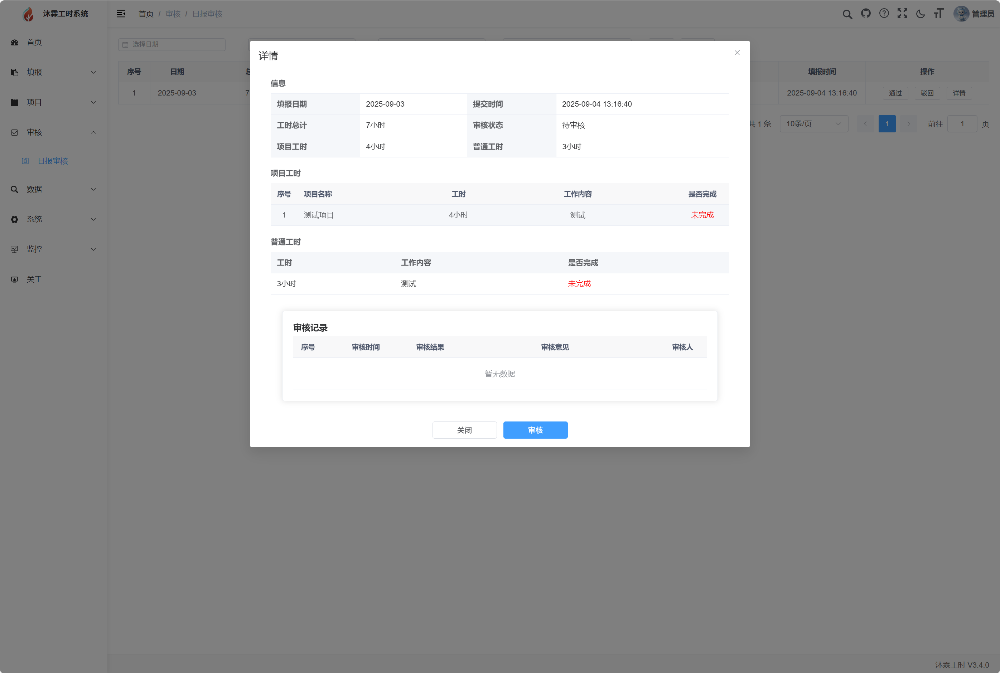

## 平台介绍

沐霖工时系统(原无鱼工时系统），是一款轻量级工时记录和管理工具，包括项目管理，工时上报，工时日报，工时统计等功能。

沐霖工时系统可通过员工工时上报的方式，来记录项目所花费的工时，帮助企业进行项目工时统计、核算人工成本。实时、动态、真实的展示项目投入。

## 软件架构

JAVA 17 + MYSQL +VUE

本项目基于前后端分离架构：

后端：springboot3

前端：Vue3 + Element Plus

##  版本说明
* **V3**
    * [x] v3.4.0 重构填报工时内容，增加任务完成度属性。
    * [x] v3.3.1 前端兼容性与调试优化。
    * [x] v3.3.0 基于SpringBoot3 + vue3.2+ 进行重构。
    * [x] v3.2.1 优化审核列表，修复审核权限校验。
    * [x] v3.2.0 重构前端布局，优化首页样式和项目列表样式。
    * [x] v3.1.0 新增“按周”维度的项目统计功能，优化项目添加人员流程。
    * [x] v3.0.0 原「无鱼工时系统」更名为「沐霖工时系统」！

##  版本计划
    * [] 增加导入工时。
    * [ ] 支持按项目进行审核。
    * [ ] 支持项目工时报表查看。

## 功能列表

## 功能截图

#### 首页

#### 工时填报

<table>
    <tr>
        <td>  
         </td>
        <td>  
      
   </td>
    </tr>

</table>

#### 工时审核

<table>
    <tr>
        <td>  
         </td>
        <td>  
      
   </td>
    </tr>

</table>

#### 数据统计

## 下载使用
请使用release进行下载，
如使用clone方式存在部分文件丢失的情况，请到网盘或者release进行下载。

## 使用文档
站内wiki

###

web 端默认地址:
http://ip:80

默认管理账号/密码：
admin/12345678

## 感谢

该项目基于若依、vue、ele-admin-ui 等相关框架，在此进行感谢。
