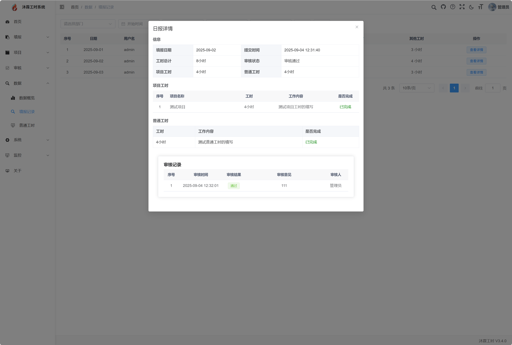
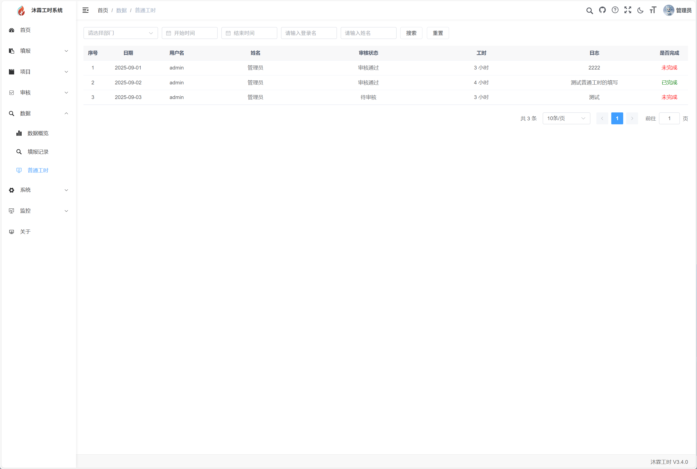

## 平台介绍

沐霖工时系统(原无鱼工时系统），是一款轻量级工时记录和管理工具，包括项目管理，工时上报，工时日报，工时统计等功能。

沐霖工时系统可通过员工工时上报的方式，来记录项目所花费的工时，帮助企业进行项目工时统计、核算人工成本。实时、动态、真实的展示项目投入。

## 软件架构

JAVA 17 + MYSQL + VUE3

本项目基于前后端分离架构：

后端：SpringBoot3 + MyBatis Plus
前端：Vue3 + Element Plus

## 版本说明

当前版本 V3.8.2

- **V3**
 -  [x] v3.8.3 修复版本，主要修复项目状态控制和工时统计的问题。
  - [x] v3.8.2 修复版本，主要修复搜索条件以及一些模块的翻页问题。
  - [x] v3.8.1 修复版本，主要修复在某些环境下无法启动的问题
  - [x] v3.8.0 增加项目工时统计模块
  - [x] v3.7.0 增加人员工时统计模块
  - [x] v3.6.1 优化部门列表，，修复项目更换项目经理的选择列表问题。
  - [x] v3.6.0 支持批量导入工时。
  - [x] v3.5.0 重构工时审核功能，支持按项目进行审核。
  - [x] v3.4.0 重构填报工时内容，增加任务完成度属性。
  - [x] v3.3.1 前端兼容性与调试优化。
  - [x] v3.3.0 基于 SpringBoot3 + vue3.2+ 进行重构。
  - [x] v3.2.1 优化审核列表，修复审核权限校验。
  - [x] v3.2.0 重构前端布局，优化首页样式和项目列表样式。
  - [x] v3.1.0 新增“按周”维度的项目统计功能，优化项目添加人员流程。
  - [x] v3.0.0 原「无鱼工时系统」更名为「沐霖工时系统」！

## 版本计划

    * [x] 支持按项目进行审核。
    * [x] 增加导入工时。
    * [x] 支持个人工时统计。(项目统计在项目看板中)
    * [x] 支持项目工时报表查看。
    * [ ] 支持按部门统计。
    * [ ] 定时任务。
    * [ ] 工时明细数据的导出（待定）。

## 功能列表
**工时模块**

1、我的工时：项目工时填报、普通工时填报、提交工时、查看详情、修改工时。

**项目模块**

1、项目管理：项目列表、项目概要、项目工时记录、项目成员管理、项目状态管理。

**审核模块**

1、项目工时审核：项目工时审核列表、工时审核、审核详情。

**数据统计**

1、数据概览统计：人员、项目、总工时、项目工时、普通工时、部门工时统计、明细查询。

2、人员统计：人员工时统计列表。

3、项目统计：项目工时统计列表。

4、填报记录查询：填报记录列表、填报记录详情。

**管理模块**

1、项目管理：创建项目、添加人员、状态管理、删除项目。

2、组织管理：用户管理、角色管理、重置密码、批量删除。

3、职位管理：包括筛选、新增、修改、删除、批量删除等功能。

## 功能截图

#### 首页

#### 工时填报

 </td>

 </td>

 </td>

#### 批量导入

 <table>
    <tr>
        <td>
         </td>
        <td>
      
   </td>
    </tr>
</table>

#### 工时审核

<table>
    <tr>
        <td>  
         </td>
        <td>  
      
   </td>
    </tr>
</table>

#### 数据看板

#### 数据查询

#### 个人工时统计

#### 项目工时统计

## 测试环境
http://150.158.90.116:10809/

账号
请联系微信： moyu-boby 获取

## 下载使用

如使用 clone 方式存在部分文件丢失的情况，请到网盘或者 release 进行下载。

## 使用文档

站内 faq
https://www.wuyusoft.com/faqs.html

###

web 端默认地址:
http://ip:80

默认管理账号/密码：
admin/12345678

## 联系交流
Q群： 336197563

微信： Maprapta （添加请备注说明）

## 感谢

该项目基于若依、vue、ele-admin-ui 等相关框架，在此进行感谢。
