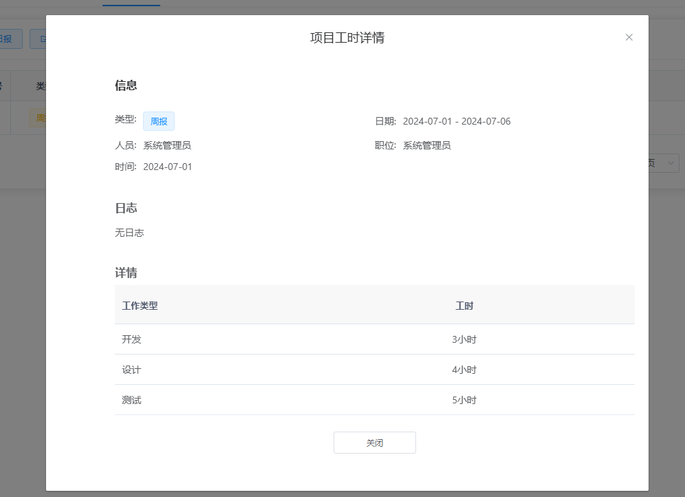
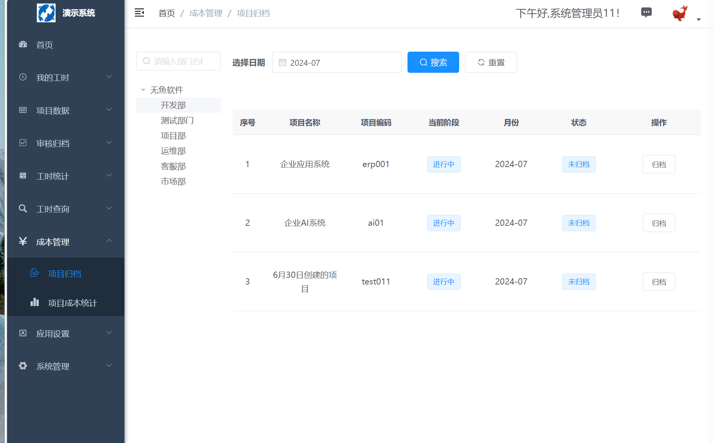
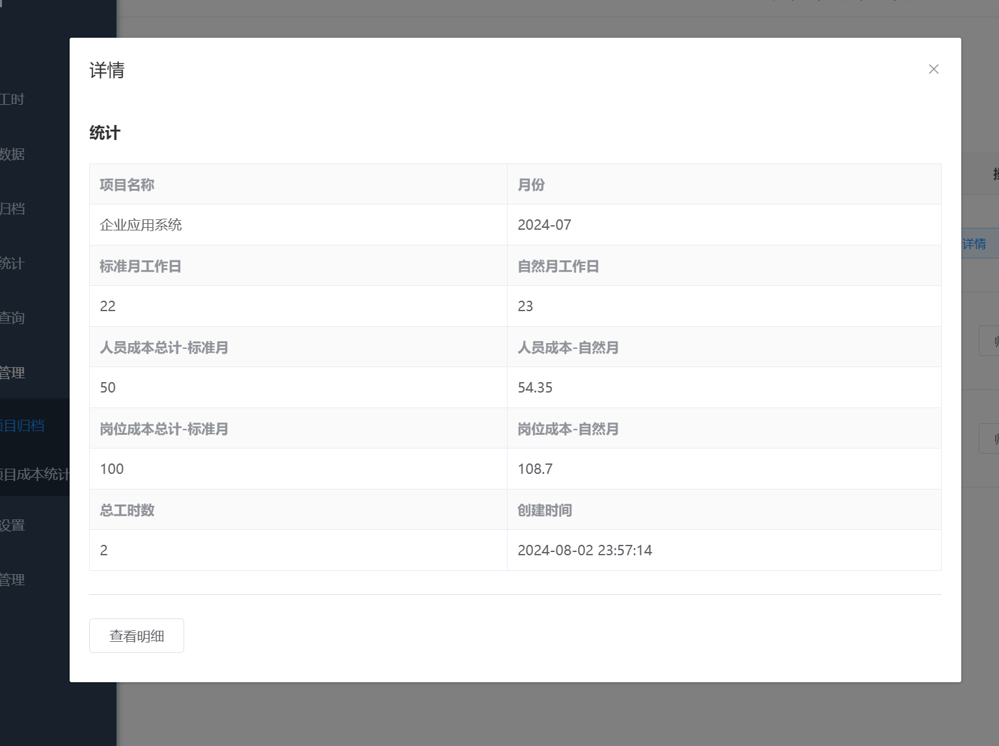

## 平台介绍

无鱼工时管理系统，是一款轻量级工时记录和管理工具，包括项目管理，工时上报，工时日报，工时统计等功能。

无鱼工时管理系统可通过员工工时上报的方式，来记录项目所花费的工时，帮助企业进行项目工时统计、核算人工成本。实时、动态、真实的展示项目投入。

## 软件架构

JAVA 1.8 + MYSQL +VUE
本项目基于前后端分离架构：
服务端：springboot
前端：vue

## 功能列表

工时模块

1、我的工时：提交工时、查看详情、修改工时、我的工时、我的统计（填报率）。

2、我的周报：提交周报、查看详情、修改周报。

3、项目统计：项目日报、项目月报、项目日历、项目工时详情。

4、项目投入：项目成本、项目投入进度、项目工时总计、工时明细、项目详情等。

5、数据统计：工时统计、人员排行、阶段统计、工作内容统计。

6、人员填报率统计：人员填报率排名、填报详情。

7、工时审核：工时审核设置、工时审批。

8、项目归档：项目工时归档、项目成本归档。

9、项目成本：项目成本统计、项目成本明细。

10、消息提醒：工时审核提醒。

管理模块

1、项目管理：创建项目、添加人员、工时设置、状态管理、删除项目。

2、业务管理：加班管理、节假日管理、工作类型管理、审核管理、归档管理。

3、成本管理：成本开关、岗位成本设置、人员成本设置。

4、组织管理：用户管理、角色管理、重置密码、批量删除。

5、职位管理：新增、修改、删除、批量删除等功能。

## 功能截图

#### 首页

#### 数据统计

<table>
    <tr>
        <td>     </td>
        <td>     </td>
    </tr>
   
</table>

#### 我的

<table>
    <tr>
        <td>     </td>
        <td>     </td>
    </tr>
    <tr>
        <td>   </td>
        <td>  </td>
    </tr>
     <tr>
        <td>   </td>
        <td>  </td>
    </tr>
</table>

#### 周报

<table>
    <tr>
        <td>     </td>
        <td>     </td>
    </tr>
    <tr>
        <td>   </td>
        <td>  </td>
    </tr>
    
</table>

#### 项目统计

<table>
 <tr>
  

  
</tr>
    <tr>
        <td>   </td>
        <td>  </td>
    </tr>
     <tr>
        <td>   </td>
        <td>  </td>
    </tr>
</table>

#### 工时统计

<table>
    <tr>
        <td>     </td>
        <td>     </td>
    </tr>
    <tr>
        <td>   </td>
        <td>  </td>
    </tr>
   
</table>

#### 项目归档

<table>
    <tr>
        <td>     </td>
        <td>     </td>
    </tr>
    <tr>
        <td>   </td>
        <td>  </td>
    </tr>
   
</table>

#### 项目成本

<table>
    <tr>
        <td>     </td>
        <td>     </td>
    </tr>
    <tr>
        <td>   </td>
        <td>  </td>
    </tr>
   
</table>

#### 手机 app 端

<table>
    <tr>
        <td>     </td>
        <td>     </td>
    </tr>
    <tr>
        <td>     </td>
        <td>     </td>
    </tr>
</table>

## 下载使用
请使用release进行下载

## 使用文档
站内wiki

###

web 端默认地址:
http://ip:80

html5/手机端默认地址：
http://ip:80/html5

默认管理账号/密码：
admin/12345678

## 感谢

该项目基于若依、vue、ele-admin-ui 等相关框架，在此进行感谢。
